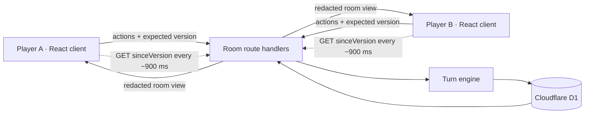

# Ink & Echo architecture

Ink & Echo is a browser drawing game with exactly two seats. The architecture is deliberately small: one React application, a Canvas 2D drawing surface, four room endpoints, and one SQLite-compatible D1 database. The mode engine is framework-agnostic TypeScript so the browser and the authoritative room service can share the same rules.

## System shape



The server is authoritative. A client may render timers and previews optimistically, but it cannot choose the actor, advance a round, or reveal a Blind Prompt target. Every mutation carries the room version it was based on.

## Recommended stack

| Concern | Choice | Why it fits a two-player game |
| --- | --- | --- |
| UI | React 19 + TypeScript | Component model, strong state typing, easy browser deployment |
| Build/runtime | Vite 8 through vinext | Fast local feedback plus route handlers in the same repository |
| Drawing | Canvas 2D + Pointer Events | No heavy drawing dependency; mouse, pen, and touch share one path |
| Server | App Router route handlers on a Cloudflare Worker | Same TypeScript project, low idle cost, close to D1 |
| Persistence | Cloudflare D1 | Rooms and gallery entries fit a small relational model |
| Realtime MVP | Conditional polling | Reliable on simple hosting, sufficient for one action every few seconds |
| Styling | Plain modern CSS | Small bundle and total control over the playful art direction |

No account is required. Joining a room returns a random player id and bearer token. The browser keeps that token for the room session; only a hash is stored in D1.

## Repository layout

```text
app/
  api/rooms/
    route.ts                    create a room
    [code]/route.ts             read a redacted room view
    [code]/join/route.ts        claim the second seat
    [code]/actions/route.ts     start, submit, reveal clue
  globals.css                   visual system and responsive layout
  layout.tsx
  page.tsx                      application entry
components/
  GameApp.tsx                   page flow and room transport
  DrawingCanvas.tsx             Canvas 2D drawing desk
lib/
  game/
    types.ts                    shared settings, turn, artifact, and gallery types
    content.ts                  seven modes plus prompt/rule/beat decks
    engine.ts                   seeded plan generation and pure state transitions
    index.ts                    public game-model exports
  server/
    room-db.ts                  D1 initialization/repository access
    room-game.ts                authoritative persisted room transitions
db/
  index.ts                      D1 binding accessor
  schema.ts                     Drizzle schema reference
drizzle/                        generated migrations
worker/index.ts                 Cloudflare Worker entry
docs/
  architecture.md
  game-design.md
```

`lib/game` has no React, DOM, database, or network imports. `createTurnPlan(settings, { seed })` always produces the same plan, making it useful in previews, pass-and-play, tests, and server validation. The server must still send a redacted `TurnView`; deterministic does not mean secret content should be broadcast.

## Game state model

### Settings

```ts
type GameSettings = {
  mode:
    | "classic-chain"
    | "memory-drift"
    | "blind-prompt"
    | "remix-mode"
    | "speed-chaos"
    | "story-canvas"
    | "guess-evolution";
  roundCount: number;       // normalized to 3–20
  timerSeconds: number;     // 10–180; Speed Chaos caps at 25
  randomPrompts: boolean;
  canvasPreset: "square" | "landscape" | "portrait";
};
```

A round is the repeatable beat for its mode. Classic Chain, Guess Evolution, and Speed Chaos count one submitted handoff per round, so nine Classic rounds contain three full trilogies. Memory Drift and Remix use an uncounted opening seed followed by the chosen transformation rounds. Blind Prompt and Story Canvas use a paired beat—prompt plus blind drawing, or panel plus caption—inside each round. The room snapshot exposes both `round` and `turnNumber` so the UI can show host-selected progress without pretending every mode has identical cadence.

### Turn plan

Each `TurnPlanItem` says:

- who acts (`actorIndex`, always alternating between `0` and `1`);
- what they produce (`artifactKind`);
- what prior information they may receive (`sourceRule`);
- what the UI says (`phaseLabel`, `headline`, `instruction`);
- how long the turn and any memory preview last;
- optional mode payload such as a clue schedule, remix rule, memory twist, or story beat;
- whether this is the finale and whether it carries a small two-person `duoBeat`.

The seven schedules are intentionally distinct:

| Mode | Repeating plan |
| --- | --- |
| Classic Chain | write → draw → guess → reset with a fresh prompt |
| Memory Drift | seed drawing → flash/hide/redraw, with shorter previews and stronger twists |
| Blind Prompt | curated hidden target + timed clue ladder; manual mode alternates secret writing and blind drawing |
| Remix Mode | seed drawing → inherit latest drawing + escalating remix card |
| Speed Chaos | sprint draw → snap guess, with a hard 25-second drawing cap |
| Story Canvas | draw a panel → caption it → draw the continuation |
| Guess Evolution | one seed prompt → draw → guess → draw only that guess, with no reset |

### Artifacts

Completed turns append one immutable artifact:

- `prompt`: text plus optional hand-authored Blind Prompt clues;
- `drawing`: exported image, backing dimensions, background, and optional stroke count;
- `guess`: text;
- `caption`: text.

The gallery zips the turn plan with artifacts rather than building a second copy of history. That preserves empty/abandoned turns for diagnostics and makes per-round downloads straightforward.

### Persisted room records

The D1 schema uses three tables:

- `rooms`: code, host id, phase, settings JSON, current game state JSON, monotonic version, timestamps;
- `players`: player id, room code, name, seat (`0` or `1`), token hash; a unique room/seat index enforces two seats;
- `room_entries`: immutable prompt/drawing/guess/caption events with an ordinal and room version.

The JSON current state is a fast snapshot. `room_entries` is the replayable audit log and gallery source. On each accepted action, insert the entry and update the room snapshot/version in one transaction or batch.

## Room API and polling protocol

The exact JSON projection may evolve, but the contract should stay small.

### `POST /api/rooms`

Input:

```json
{
  "playerName": "Mina",
  "settings": {
    "mode": "memory-drift",
    "rounds": 8,
    "timerSeconds": 60,
    "randomPrompts": true,
    "canvasSize": "landscape"
  }
}
```

Creates the room, claims seat 0, and returns `{ room, playerId, playerToken }`. Codes should avoid ambiguous characters and collisions. The token is shown only once.

### `POST /api/rooms/:code/join`

Claims seat 1 atomically. A third join returns `409 Room is full`. A repeated join should use the saved token rather than create another player.

### `GET /api/rooms/:code`

Query parameters include `playerId`, `playerToken`, and optional `sinceVersion`. If the room has not changed, return `304` or a compact unchanged response. Otherwise return the viewer-specific room projection.

The projection must redact:

- another player's bearer token;
- the text of an active Blind Prompt target;
- artifacts the current mode does not allow the viewer to see yet;
- gallery-only reveal information until the room finishes.

### `POST /api/rooms/:code/actions`

Input includes credentials, `expectedVersion`, and an action:

```json
{
  "playerId": "p_…",
  "playerToken": "secret_…",
  "expectedVersion": 12,
  "action": {
    "type": "submit_drawing",
    "imageData": "data:image/webp;base64,…",
    "metadata": { "width": 1280, "height": 800, "backgroundColor": "#fffaf0" }
  }
}
```

Supported actions are `start_game`, `submit_text`, `submit_drawing`, and `add_clue`. The handler verifies room phase, token, active player, expected artifact kind, payload limits, and the expected room version. A stale action returns `409`; the client immediately refreshes and lets the user resubmit only if it is still their turn.

### Poll loop

1. Fetch immediately after create, join, or mutation.
2. While waiting for the other player, poll with `sinceVersion` every 800–1,200 ms.
3. On `304`, leave React state untouched.
4. On a new version, replace the room projection as one snapshot.
5. Back off after repeated network errors (for example 1 s → 2 s → 4 s, capped near 10 s) and show a reconnecting note.
6. Pause polling while the tab is hidden; refresh immediately on `visibilitychange`.

Polling is intentionally adequate here: exactly two clients, relatively long creative turns, and tiny state responses. Images should only appear in the response when newly needed; otherwise send entry ids or storage URLs.

## Drawing canvas design

The canvas should have a fixed backing resolution from the selected preset while CSS scales it to the available workspace. Convert pointers with `backingSize / getBoundingClientRect()` so strokes remain correct at any screen size or zoom.

The MVP uses a compact bitmap history entry after each committed change:

```ts
type HistoryEntry = {
  contentDataUrl: string;   // transparent drawing layer
  backgroundColor: string; // separately undoable paper color
};
```

- Use Pointer Events and `setPointerCapture`; set `touch-action: none` only on the drawable surface.
- Smooth freehand points with quadratic midpoints or a lightweight velocity-aware interpolation.
- Keep a capped history (32 entries by default), restore the selected PNG snapshot on undo/redo, and discard the redo tail after a new mark.
- Preview shapes on the same canvas by restoring a temporary `ImageData` snapshot during pointer movement, then commit once on pointer-up.
- Erase with `globalCompositeOperation = "destination-out"`; render the chosen background on export.
- Treat background/fill changes as undoable operations.
- Keep the toolbar outside the drawable rectangle on desktop and in a compact bottom sheet on phones.
- Keyboard defaults: `P` pen, `E` eraser, `L` line, `R` rectangle, `O` ellipse, `A` arrow, `T` text, `[`/`]` size, `Ctrl/Cmd+Z` undo, `Ctrl/Cmd+Shift+Z` redo, `0` fit.
- Export WebP when supported, otherwise PNG. Validate dimensions and decoded byte size server-side; do not trust the data URL header alone.

An operation log is a useful later optimization if sessions need hundreds of edits, collaborative live strokes, or resolution-independent replay. The current snapshot approach deliberately favors a smaller implementation and exact visual restoration.

For the first version, storing compact image data directly in D1 keeps deployment simple. The practical next step is R2/Supabase Storage plus a thumbnail, especially if the room count or canvas resolution grows.

## Security and failure behavior

- Room codes locate rooms; they are not authorization.
- Hash player tokens with Web Crypto before persistence and compare in constant-time where available.
- Limit player names, prompt lengths, clue counts, image dimensions, and decoded image bytes.
- Escape all text through React; never render user HTML.
- Use a version compare-and-swap on every write to prevent double submissions.
- The server emits a canonical `deadlineAt`; clients count against it and automatically submit the current Speed Chaos turn at zero. The D1 polling MVP deliberately accepts reconnect submissions after that instant because it cannot schedule a transition while both players are offline. Move timer alarms and strict cutoff enforcement into a Durable Object when competitive timing or public matchmaking is added.
- Keep completed gallery data read-only. A replay starts a new room/seed.
- Expire abandoned rooms on a schedule and delete their image objects with them.

## Upgrade paths

### Supabase Realtime

Replace the D1 repository with Postgres tables of the same shape, place drawings in Supabase Storage, and subscribe both clients to room/entry changes. Row-level security should allow reads only to players with a room membership and writes only through an Edge Function or RPC that performs the version check. Presence can replace connected/disconnected polling, but the authoritative turn transition remains server-side.

Keep secret prompt text in a private table or RPC result. Do not publish that column on a Realtime channel. Send only the active clue projection to the drawer.

### WebSockets / Cloudflare Durable Objects

A Durable Object per room is the cleanest WebSocket upgrade: it serializes both players' actions, broadcasts new projections, owns timer alarms, and can persist the final event chain to D1/R2. The React transport changes from `pollRoom()` to a small event stream; `lib/game` and the gallery format do not change.

### Transport boundary

Keep the client behind a narrow adapter:

```ts
interface RoomTransport {
  create(input: CreateRoomInput): Promise<Session>;
  join(code: string, name: string): Promise<Session>;
  read(session: Session, sinceVersion?: number): Promise<RoomView | "unchanged">;
  act(session: Session, version: number, action: RoomAction): Promise<RoomView>;
}
```

That boundary makes polling, Supabase, or WebSockets interchangeable without rewriting page flow or drawing tools.

## Verification plan

At minimum, automate these cases:

1. Every mode generates exactly the configured number of turns and alternates actors.
2. The same seed/settings produce byte-for-byte identical plans.
3. Speed Chaos timers never exceed 25 seconds.
4. Blind Prompt views never include `secretPrompt` before gallery reveal.
5. Invalid actors and artifact kinds cannot advance state.
6. A room cannot start with one player or accept a third player.
7. Two writes with the same expected version yield one success and one conflict.
8. Pointer coordinates remain correct after responsive scaling.
9. Undo/redo restores identical pixels for every operation type.
10. A completed game reloads into the same gallery order.
