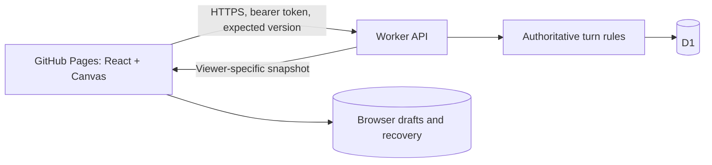

# Ink & Echo architecture

## Runtime boundaries

`frontend/main.tsx` mounts the existing `GameApp`. `vite.pages.config.ts` builds a static SPA at `/ink-and-echo/`; invitations use `?room=CODE` on that path. There are no pathname routes requiring rewrites. `INK_API_ORIGIN` is a validated public HTTPS origin; an absent origin fails clearly for online actions.

`worker/api.ts` dispatches the existing `app/api/rooms` handlers and exposes `/api/health`. It bundles with Wrangler without an SSR runtime. `DB` is a D1 binding. `worker/http-policy.ts` supplies exact-origin CORS/preflight, no-store, nosniff, and no-referrer. CORS is not authorization: private reads/mutations still verify player credentials. Production configuration is generated into ignored `work/` from backend environment values.

The older Worker/vinext setup and app layout are preserved for integrated local development and rollback. The old `.openai/hosting.json` records identity only; no new Sites deployment is part of the workflow.

## State and authority

`lib/server/room-game.ts` contains the pure persisted game rules: settings, initial state, text/drawing advancement, clues, source selection and deadlines. `lib/client/local-game.ts` reuses these rules for pass-and-play and projects them into UI types. The earlier `lib/game` planner remains covered as a separate domain module; it is not the authoritative online runtime.

`lib/server/room-service.ts` owns authentication, limits, lifecycle, versions, and redaction. D1 stores:

- `rooms`: settings, game state, version, activity and expiry;
- `players`: exactly two seats, token hashes, presence and leave state;
- `room_entries`: ordered immutable artifacts;
- `rate_limit_buckets`: request windows.

Writes use an expected version; simultaneous submissions cannot both advance the room. PNG/JPEG/WebP data URLs have format-signature, dimension and encoded-size validation. SVG, remote URLs, oversized payloads and malformed JSON are rejected. React renders player text as text. Hidden targets/disallowed history are omitted until the gallery.

## API

| Method | Path | Purpose |
| --- | --- | --- |
| GET | `/api/health` | App identity and D1 readiness |
| POST | `/api/rooms` | Create host seat and room |
| POST | `/api/rooms/:code/join` | Claim the second seat |
| GET | `/api/rooms/:code` | Authenticated snapshot; conditional 304 |
| POST | `/api/rooms/:code/actions` | Start, submit, add clue |
| POST | `/api/rooms/:code/recover` | Rotate active and recovery tokens |
| POST | `/api/rooms/:code/heartbeat` | Presence |
| POST | `/api/rooms/:code/leave` | Release seat and transfer host |
| DELETE | `/api/rooms/:code` | Host deletion of completed room |

Authentication uses `Authorization: Bearer …` and `X-Player-Id`, never query tokens. Recovery accepts a player id and recovery token in a POST body. Invitations contain only the room code. Private recovery links put their secret in a fragment, cleared after use; recovery rotates that secret.

## Client reliability

Active credentials live in sessionStorage; durable recovery credentials in localStorage. Storage getters may throw and are guarded. Persistence failure displays a warning without preventing in-tab play.

Requests time out after 15 seconds. Polling normally uses ~900 ms intervals, pauses while hidden, wakes on visibility changes and backs off up to 10 seconds. Aborted/obsolete polling responses cannot apply a snapshot. Successful authentication recovery schedules another poll. Same-browser tabs signal through BroadcastChannel; a local action lease supplements server version checks.

Draft keys contain room/player/turn identity. Pass-and-play adds a unique game id, so new games do not restore old drafts. IndexedDB writes are successful only after transaction commit. Reads inspect both IndexedDB and localStorage and choose the newest valid draft, including when IndexedDB recovers. Canvas input waits for draft restoration. Confirmed submissions delete matching drafts; ambiguous network responses retain them.

Pass-and-play saves its room snapshot locally and can resume from the landing page after refresh. Its timer uses an anchored deadline, not interval tick counts. Local games are intended for two people sharing a browser; they are not private from others using that browser.

Server timestamps determine online deadlines. Drawing turns retain a 15-second delivery grace; text turns have a small transport grace. The UI never chooses the online actor or commits an expired action itself. Presence and expiry are request-driven, not a guaranteed background scheduler. Waiting rooms expire after 24 hours, active rooms after 48 hours of inactivity, galleries after seven days; opportunistic cleanup removes expired records.

## Canvas and archives

`DrawingCanvas.tsx` uses stable backing dimensions and scaled pointer coordinates. Transparent ink and paper color are separate; export composites them. Undo/redo keeps compressed snapshots within a memory budget. Submission compresses/resizes to server limits; local opening validates size/type/dimensions before decoding.

`story-archive.ts` accepts original unversioned and version 1 exports. It validates schema, sizes and embedded images; whitelists gallery fields; excludes credentials/hidden state; and preserves expired placeholders. Imports are local/read-only, limited to 64 MB and 80 turns. Export uses a Blob URL with delayed revocation.

## Verification limits and growth

Unit tests cover rules, transport, credentials, storage failures and imports. Real HTTP tests cover two-seat lifecycle and concurrency. Browser evidence adds desktop/mobile layout, keyboard focus, drawing undo/redo, room refresh and archive import. Exact coverage and limits are in the audit log.

Free Worker/D1 quotas bound capacity. Images remain in D1; a large public audience would require a capacity assessment and explicit cost approval before adding paid infrastructure. No such upgrade is enabled here.
